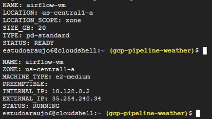
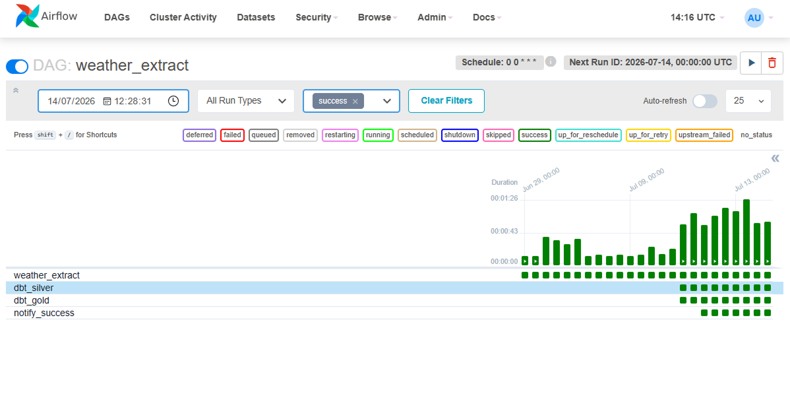
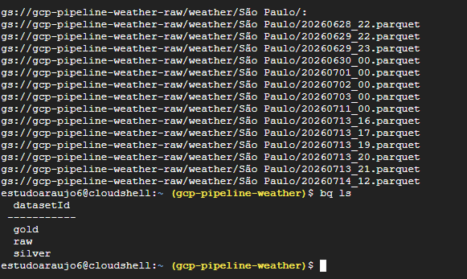
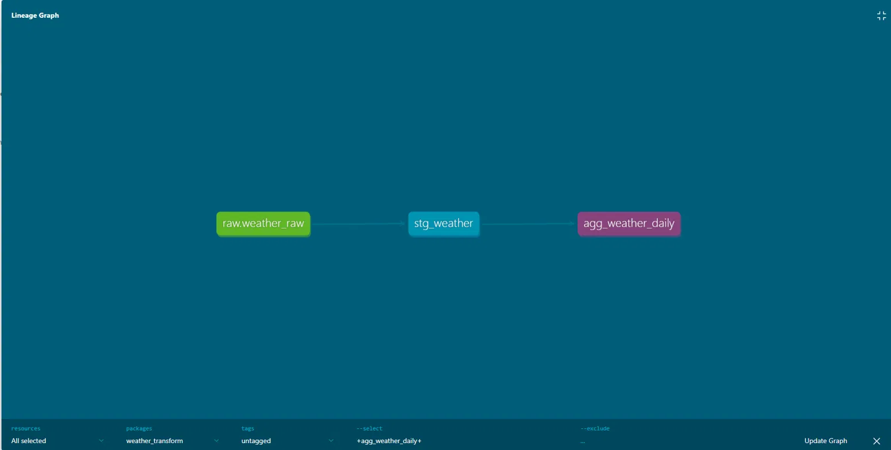
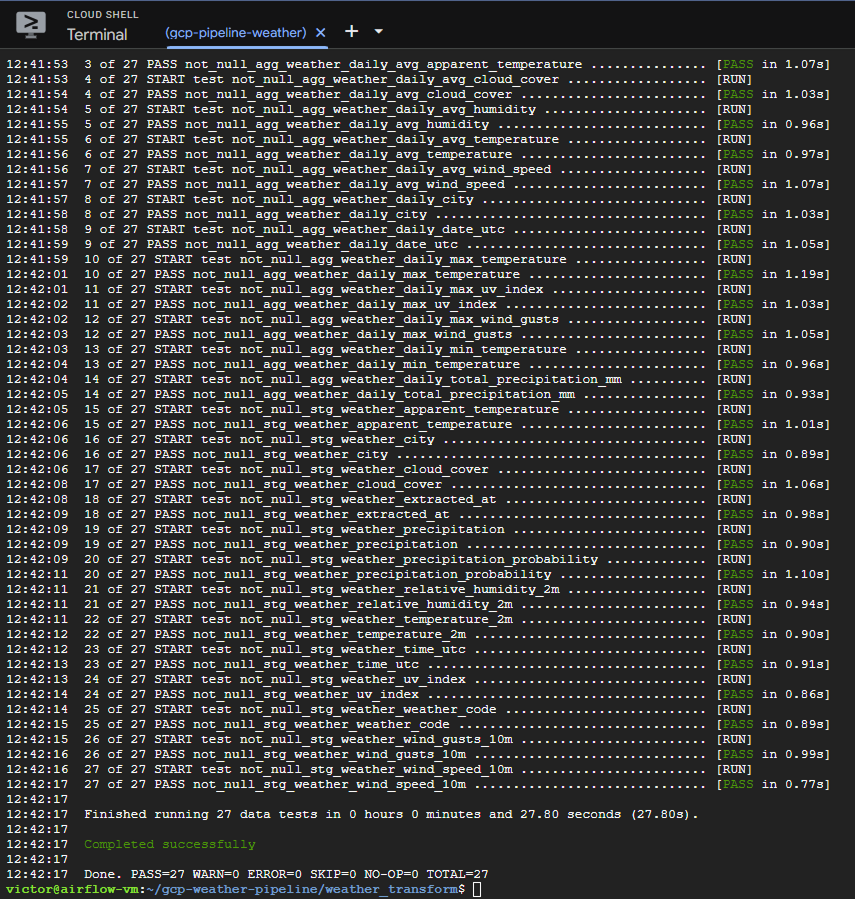
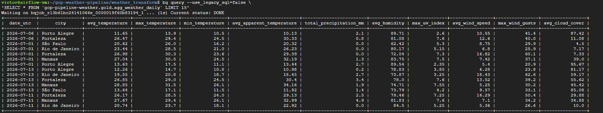

# GCP Weather Pipeline
 


 
Pipeline de engenharia de dados end-to-end na Google Cloud Platform que extrai dados climáticos horários de 5 capitais brasileiras, processa via arquitetura Medallion (Raw → Silver → Gold) e orquestra com Apache Airflow.
 
**[Documentação interativa e lineage do pipeline](https://victoraraujo965.github.io/gcp-weather-pipeline/#!/overview/weather_transform)**
 
---
 
## Por que este projeto existe
 
Clima move decisão de negócio. Varejo dimensiona estoque por sazonalidade, logística replaneja rota por chuva, agro decide plantio, energia projeta demanda, seguradora precifica risco.
 
O problema raramente é falta de dado — é dado que chega tarde, quebrado, e sem ninguém saber. Este projeto resolve isso: os dados chegam sozinhos, são testados antes de virar número em relatório, e alguém é avisado quando algo quebra.
 
| Métrica | Valor |
|---|---|
| Registros horários processados | 1.224 |
| Agregações diárias (Gold) | 51 |
| Testes de qualidade por execução | 27 (100% pass) |
| Execuções consecutivas sem falha | 24 |
| Capitais monitoradas | 5 |
 
---
 
## Arquitetura
 
```
Open-Meteo API
      ↓
Python Extractor (Airflow DAG)
      ↓
Google Cloud Storage (Parquet · Raw)
      ↓
BigQuery Raw
      ↓
dbt Silver → dbt Gold
      ↓
Alertas via Telegram
```
 
## Stack
 
| Camada | Tecnologia |
|---|---|
| Orquestração | Apache Airflow 2.9.3 (Docker) |
| Extração | Python 3.10 + requests + pandas |
| Data Lake | Google Cloud Storage (Parquet) |
| Data Warehouse | BigQuery (Raw / Silver / Gold) |
| Transformação | dbt 1.11 + dbt_utils |
| Infraestrutura | Terraform (IaC) |
| Observabilidade | Telegram Bot (sucesso e falha) |
| Ambiente | GCE e2-medium (4GB RAM, Docker) |
 
---
 
## Infraestrutura como Código
 
Toda a infraestrutura é provisionada via Terraform: VM, buckets, datasets, IAM e rede. Reproduzível, versionada e auditável. Um `terraform apply` recria o ambiente inteiro do zero.
 

 
---
 
## Execução em Produção
 
24 execuções consecutivas, zero falhas. A DAG orquestra extração, transformação dbt (Silver e Gold) e notificação. Não são scripts rodados na mão.
 

 
---
 
## Data Lake e Data Warehouse
 
Os dados brutos são gravados em Parquet no GCS, particionados por cidade e timestamp. Do lake, seguem para o BigQuery nas três camadas da arquitetura Medallion.
 

 
---
 
## Linhagem de Dados
 
O grafo de linhagem é gerado automaticamente pelo dbt a partir das dependências declaradas no código. Não é um diagrama desenhado à mão: se um modelo muda, a linhagem acompanha.
 

 
**[Explore a documentação navegável](https://victoraraujo965.github.io/gcp-weather-pipeline/#!/overview/weather_transform)**
 
---
 
## Qualidade de Dados
 
27 testes automatizados rodam a cada execução da pipeline. Se um dado furado entra, o pipeline para antes de contaminar o relatório de alguém.
 
- `not_null` em todas as colunas críticas da Silver e Gold
- `accepted_values` para validar as 5 capitais monitoradas
- `dbt_utils.unique_combination_of_columns` garantindo que não existem duplicatas por cidade e hora

 
---
 
## Resultado — Camada Gold
 
Agregações diárias por cidade, prontas para consumo analítico. O analista consulta aqui sem precisar transformar nada no BI.
 

 
---
 
## Decisões de Arquitetura
 
**Por que GCS antes do BigQuery?**
O dado bruto é salvo em Parquet no GCS antes de ser carregado no BigQuery. Essa separação garante que o dado original nunca é perdido: mesmo que uma transformação quebre, o Raw está intacto no Data Lake. É o padrão adotado em pipelines empresariais com Airbyte, Fivetran e similares.
 
**Por que Parquet?**
Formato colunar, comprimido e otimizado para leitura analítica. Reduz custo de armazenamento e é o formato nativo de ecossistemas de dados modernos (Spark, BigQuery, dbt).
 
**Por que arquitetura Medallion?**
- **Raw:** dado bruto, imutável, nunca alterado
- **Silver:** dado limpo, deduplicado, tipado corretamente e particionado por data
- **Gold:** agregações diárias prontas para consumo
**Por que dbt?**
Versionamento de transformações SQL, testes de qualidade nativos, documentação automática e lineage do pipeline. Substitui transformações feitas diretamente no BI (Power BI/DAX), deixando o dado pronto antes de chegar na camada de visualização.
 
**Por que particionamento no BigQuery?**
As tabelas Silver e Gold são particionadas por data (`time_utc` e `date_utc`). Queries filtradas por período leem apenas as partições necessárias, reduzindo custo e latência.
 
---
 
## Observabilidade
 
Alertas via Telegram Bot integrados ao Airflow:
- Notificação de **sucesso** ao final de cada execução
- Notificação de **falha** com DAG e task identificadas
Credenciais gerenciadas via Airflow Variables. Nenhum segredo hardcoded no código.
 
---
 
## Custo estimado (mensal)
 
| Recurso | Custo estimado |
|---|---|
| GCE e2-medium (720h) | ~R$ 55 |
| IP estático | ~R$ 8 |
| Cloud Storage | < R$ 1 |
| BigQuery | < R$ 1 |
| **Total** | **~R$ 65/mês** |
 
---
 
## Estrutura do Projeto
 
```
gcp-weather-pipeline/
├── dags/
│   └── weather_dag.py                  # DAG principal do Airflow
├── src/
│   └── extractors/
│       └── weather_extractor.py        # Extração, parse e load
├── weather_transform/
│   ├── models/
│   │   ├── silver/
│   │   │   └── stg_weather.sql         # Limpeza e deduplicação
│   │   ├── gold/
│   │   │   └── agg_weather_daily.sql   # Agregações diárias
│   │   ├── schema.yml                  # Documentação e testes
│   │   └── sources.yml                 # Fontes de dados
│   ├── macros/
│   │   └── generate_schema_name.sql    # Materialização por camada
│   └── packages.yml
├── terraform/                          # IaC — infraestrutura completa
├── docs/                               # dbt docs (GitHub Pages) + evidências
├── docker-compose.yml                  # Airflow + Postgres
└── .env.example                        # Variáveis necessárias
```
 
---
 
## Como executar
 
### Pré-requisitos
- GCP Project com billing ativo
- Terraform, Docker e Docker Compose instalados
### 1. Provisionar infraestrutura
```bash
cd terraform
terraform init
terraform apply
```
 
### 2. Configurar variáveis
```bash
cp .env.example .env
# Preencher as variáveis no .env
```
 
### 3. Subir o Airflow
```bash
docker-compose up -d
```
 
### 4. Inicializar o banco do Airflow
```bash
docker-compose run --rm airflow-webserver airflow db init
docker-compose run --rm airflow-webserver airflow users create \
  --username admin --password sua_senha \
  --firstname Admin --lastname User \
  --role Admin --email admin@email.com
```
 
### 5. Configurar as Airflow Variables
```bash
docker-compose exec airflow-webserver airflow variables set TELEGRAM_TOKEN "<seu_token>"
docker-compose exec airflow-webserver airflow variables set TELEGRAM_CHAT_ID "<seu_chat_id>"
```
 
### 6. Ativar a DAG
Acesse `http://<VM_IP>:8080` e ative a DAG `weather_extract`.
 
---
 
## Dados coletados
 
10 métricas horárias via [Open-Meteo API](https://open-meteo.com/) para São Paulo, Rio de Janeiro, Manaus, Porto Alegre e Fortaleza:
 
`temperature_2m` · `apparent_temperature` · `precipitation_probability` · `precipitation` · `relative_humidity_2m` · `uv_index` · `wind_speed_10m` · `wind_gusts_10m` · `cloud_cover` · `weather_code`
